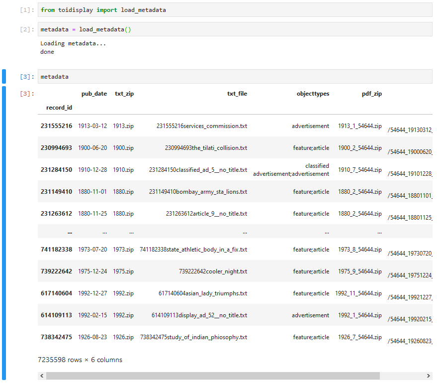
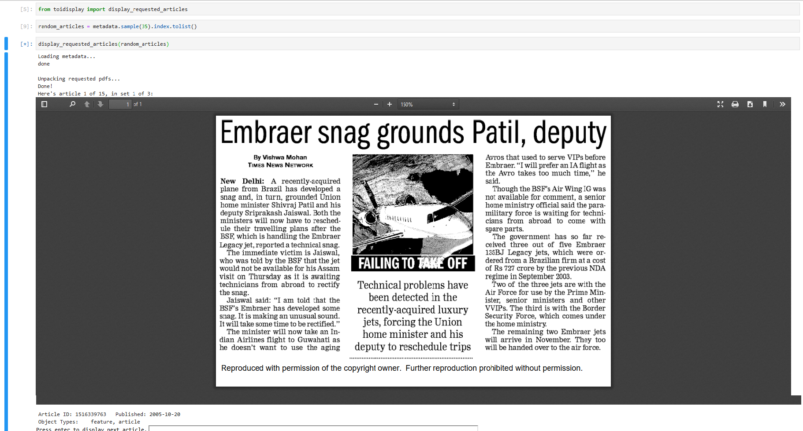

# toi_archive

This is a container for the Times of India archive from ProQuest, with a utility module to make it easy to lookup toi articles. The underlying data is not posted online for copyright reasons.

To make this utility functional, you'll need to place the TXT/, PDF/, and TOI_Metadata.zip files from the proquest archive in the toi_archive folder. The .gitignore file is set up to prevent uploads of these files.


The lookup utility is 'toidisplay.py'

## load_metadata: load TOI metadata in one line

``` load_metadata(archive_location='.') ```

Arguments:

* archive_location: dtype = string. When loading the TOI metadata in any other folder, pass the name of the main toi_archive folder as archive_location

### load_metadata in action:



## display_requested_articles: display articles, tag them, and save the tags to file

```
display_requested_articles(display_list=None, 
                           linked_function=None, 
                           save_function=None, 
                           archive_location='.', 
                           chunk_size=15)
```

Arguments:

* display_list: dtype = list/function/None. Takes a list of article IDs to display or a function generating a list of article IDs. If no list or function is passed, the program will prompt for manual entry, which can include multiple IDs using space, comma, or semicolon separators.

* linked_function: dtype = function. A function to be performed after every article is displayed. A tagging-like task was initially in view.

* save_function: dtype = function. A function to be performed after data entry, to save data to a preferred location.

* archive_location: dtype = string. When displaying articles in a notebook in any other folder, pass the name of the main toi_archive folder as archive_location

* chunk_size: dtype = int. The number of articles to display in each chunk. After every chunk, the save_function will be implemented, and the program will prompt to continue or quit.

Please note: this currently only works in browser-based jupyter notebooks because it depends on Iframe for PDF display.

### display_requested_articles in action:



### To Do List
- [ ] Implement ImageMagick-based display option
- [ ] Use isnotebook to autodetect whether to use Iframe or ImageMagick system